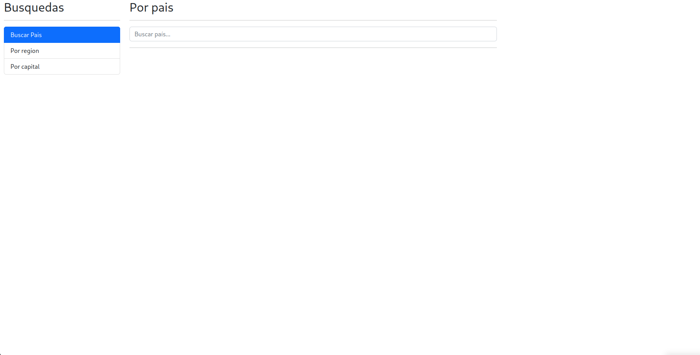
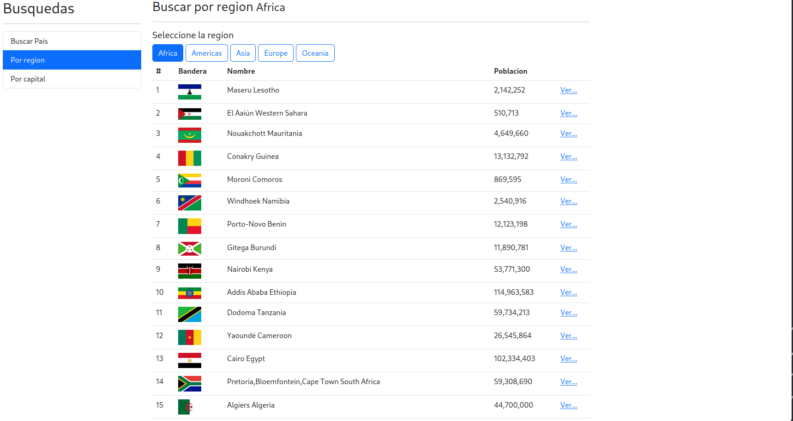
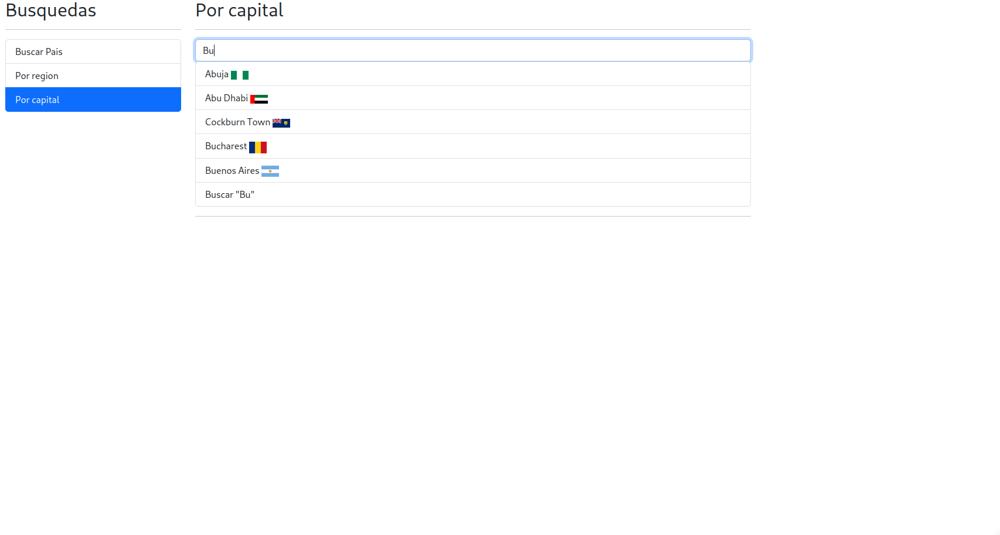
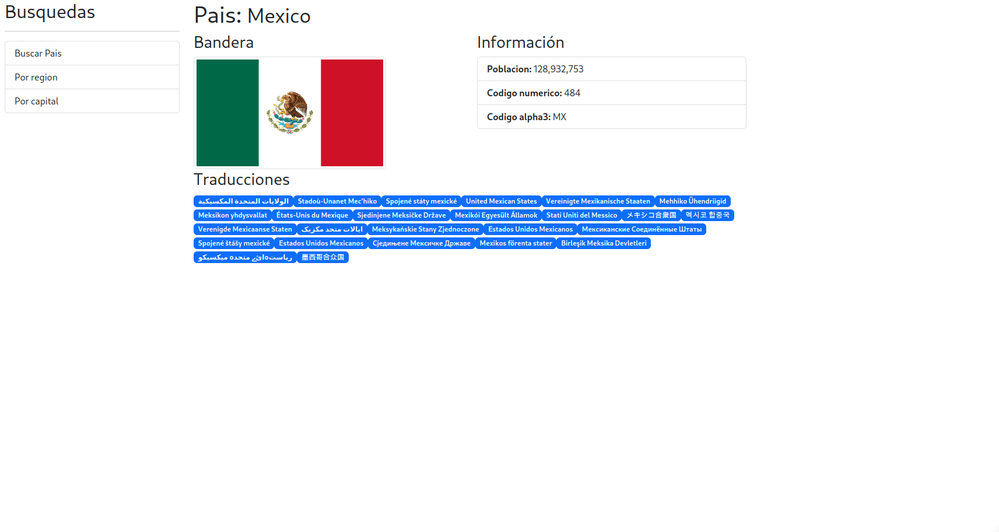

# Buscador de Países

Una aplicación web desarrollada en Angular que te permite buscar países y filtrarlos por región.

## Contenido

1. [Descripción](#descripción)
2. [Funcionalidades](#funcionalidades)
3. [Capturas de Pantalla](#capturas-de-pantalla)
4. [Requisitos](#requisitos)
5. [Instalación](#instalación)
6. [Uso](#uso)
7. [Contribución](#contribución)
## Descripción

Esta aplicación Angular te permite buscar países de todo el mundo utilizando un motor de búsqueda. Además, ofrece la funcionalidad de filtrar países por región, como África, América, Europa, etc. También puedes buscar países específicos dentro de una región. Es una herramienta útil para obtener información sobre países y regiones de una manera sencilla y rápida.

Los paises se extrae desde una API Rest publica: https://restcountries.com/

## Funcionalidades

- **Búsqueda de Países:** Utiliza el motor de búsqueda para encontrar países por nombre.
- **Filtrado por Región:** Filtra los países por regiones, incluyendo África, América, Asia, Europa y Oceanía.
- **Detalle de Países:** Haz clic en un país para ver detalles adicionales, como su capital, población, traducciones, Codigo numerico, etc.

## Capturas de Pantalla


*Página principal con el motor de búsqueda.*


*Filtrado por región.*


*Filtrado por capital.*


*Detalle de un pais.*

## Requisitos

Asegúrate de tener las siguientes herramientas instaladas antes de ejecutar la aplicación:

- [Node.js](https://nodejs.org/)
- [Angular CLI](https://cli.angular.io/)

## Instalación

1. Clona este repositorio en tu máquina local usando Git:

```bash
git clone https://github.com/JavierDuranFlores/PaisesApp-Angular.git
```
2. Navega al directorio del proyecto:

```bash
cd PaisesApp-Angular
```
3. Instala las dependencias del proyecto:

```bash
npm install
```

## Uso

1. Inicia la aplicación Angular:

```bash
ng serve
```

2. Abre tu navegador web y ve a http://localhost:4200/ para utilizar la aplicación.

## Contribución

Si deseas contribuir a este proyecto, sigue estos pasos:

1. Realiza un fork del repositorio.
2. Crea una rama con tu nueva característica o corrección: git checkout -b mi-caracteristica.
3. Realiza tus cambios y haz commits: git commit -m 'Agrega nueva característica'.
4. Sube tus cambios a tu repositorio en GitHub: git push origin mi-caracteristica.
5. Crea un Pull Request en el repositorio original.